# Forge

Forge is a local-first autonomous software engineering platform. It is designed to inspect a repository, plan a change, execute code modifications, run validation, repair failures, and converge on a result while using local models and local infrastructure.

The core technical idea is simple to describe and difficult to build: Forge runs a multi-model engineering workflow on a single workstation GPU by loading exactly one vLLM runtime at a time, executing that model, shutting it down, and swapping to the next model. This allows a local machine to coordinate specialized coding, synthesis, and judging models without paying for cloud inference or requiring simultaneous multi-GPU serving.

Forge is not a chat wrapper. It is an orchestration system for autonomous repository work.

---

## 1. Executive Summary

Modern autonomous coding systems are difficult because software engineering is not a single prompt problem. A real agent must:

- understand repository architecture
- retrieve relevant context without flooding the model
- plan across files
- generate structured patches
- write files safely
- run tests and builds
- diagnose failures
- repair code
- validate acceptance criteria
- preserve Git safety
- remember previous work
- expose enough telemetry for an operator to trust the system

Forge tackles those problems as a local systems architecture. The system keeps inference, memory, repository indexing, telemetry, patch generation, and validation under operator control.

The platform is built around three sequential courtroom roles:

- `PRIMARY_CODER` generates implementation artifacts.
- `DEEPSEEK_SYNTH` critiques architecture and risk.
- `JUDGE` validates whether the work should be accepted.

The models do not run simultaneously. Forge uses a single active runtime and swaps models through a runtime lifecycle layer.

---

## 2. Vision

Forge exists to prove that autonomous software engineering can be local-first.

Local-first means:

- no OpenAI dependency
- no Anthropic dependency
- no Gemini dependency
- no paid API requirement
- no SaaS inference requirement
- no cloud memory store requirement
- no vendor-owned repository context

The long-term goal is a workstation-deployable AI engineering agent that can work on real repositories with local models, local embeddings, local vector databases, local Git operations, and local validation.

Forge aims at the gap between IDE assistant and autonomous engineering worker:

- an IDE surface comparable to VSCode, Cursor, Claude Code, Codex, and Linear
- an execution backend comparable to agentic systems such as OpenHands and Devin-style workflows
- an inference strategy optimized for a single local GPU

---

## 3. System Architecture

Forge is organized as a set of cooperating systems rather than one monolithic agent. Each layer has a defined responsibility and produces inspectable artifacts.

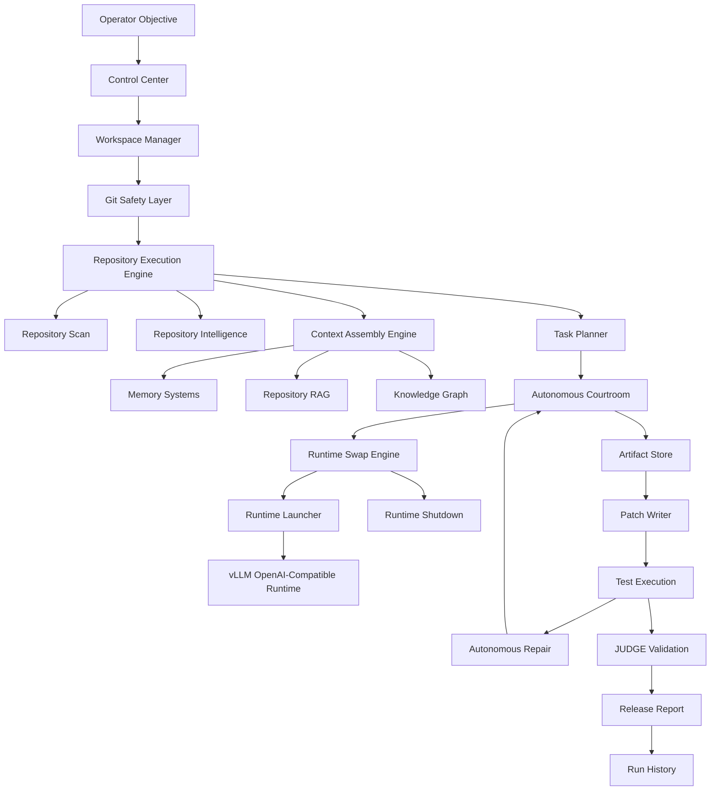

### Architecture Principles

- The backend architecture is preserved as explicit subsystems.
- Runtime orchestration is separated from cognition.
- Repository intelligence is computed before coding.
- Memory augments context but never replaces the active objective.
- Patches are generated as structured artifacts, not free-form prose.
- Validation gates determine whether a run can converge.
- Git isolation protects real repositories.

---

## 4. Runtime Architecture

Forge serves local models through vLLM OpenAI-compatible servers. Only one model runtime is active at a time.

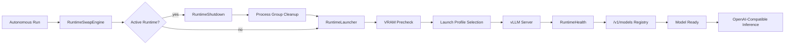

Runtime components:

| Component | Responsibility |
| --- | --- |
| `RuntimeProcess` | Stores role, model name, model path, port, pid, pgid, and lifecycle state |
| `RuntimeLauncher` | Starts vLLM with preflight VRAM checks and fallback launch profiles |
| `RuntimeHealth` | Verifies readiness using valid `/v1/models` registry data |
| `RuntimeShutdown` | Terminates API server, EngineCore, CUDA workers, and process groups |
| `RuntimeSwapEngine` | Coordinates sequential runtime transitions |
| `LocalInference` | Sends OpenAI-compatible chat completion requests |

---

## 5. Autoswap Architecture

The core constraint is a single GPU. Running three large models at once would exceed VRAM. Forge solves that by treating model execution as a staged runtime pipeline.

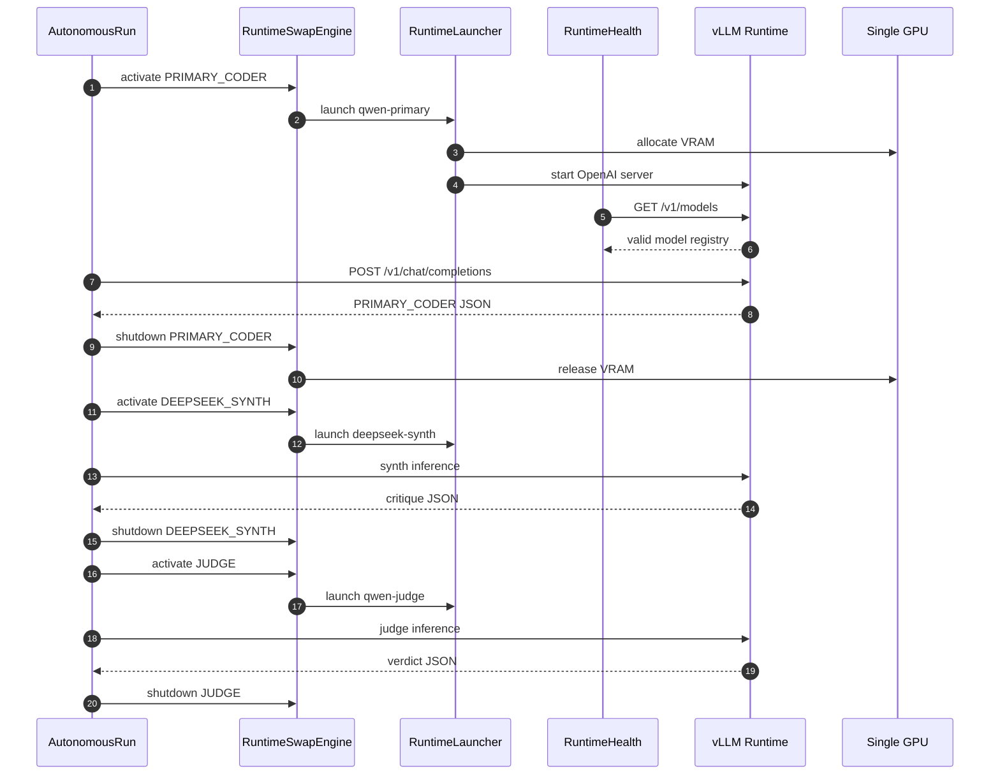

Why this is hard:

- runtime startup latency must not break orchestration state
- port conflicts must be detected and recovered
- readiness must not race server boot
- CUDA workers must be cleaned up reliably
- launch profiles must adapt to available VRAM
- model context limits must be reflected in prompt budgeting
- inference errors must not leave stale runtimes behind

---

## 6. Courtroom Architecture

Forge uses a courtroom-style cognition model. Each role has a distinct function, output contract, and validation responsibility.

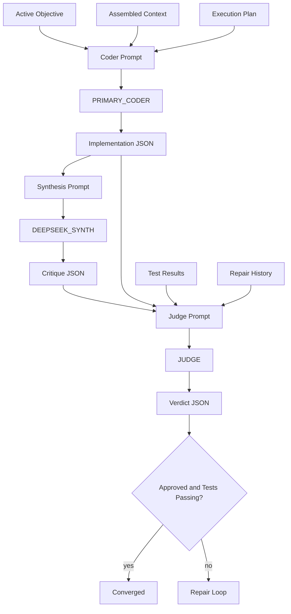

### Role Responsibilities

| Role | Purpose | Strength | Weakness Controlled By |
| --- | --- | --- | --- |
| `PRIMARY_CODER` | Writes implementation artifacts and full file contents | Code synthesis and feature construction | schema validation, patch validation, tests |
| `DEEPSEEK_SYNTH` | Reviews design, risks, and recommended changes | Architectural critique and second-pass reasoning | structured output contract |
| `JUDGE` | Approves or rejects based on patch, tests, acceptance, and repair history | Final validation and convergence decision | cannot approve failing tests |

Forge intentionally does not collapse these roles into one model. Multiple specialized passes reduce false positives, add architectural critique, and create explicit validation boundaries.

---

## 7. Multi-Agent Model Interaction Flow

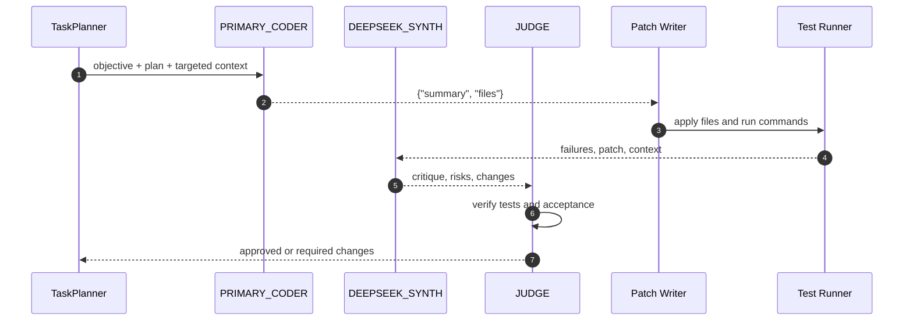

Each model is required to emit structured JSON. Forge validates, recovers, retries, and rejects malformed outputs rather than treating arbitrary text as executable state.

---

## 8. Repository Intelligence

Repository intelligence runs before coding. Forge must understand the target repository before it asks a model to modify it.

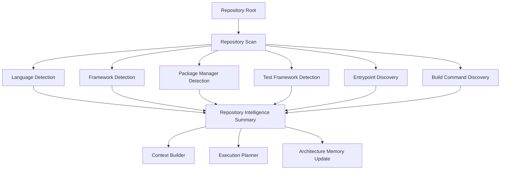

Forge detects and plans for:

- Python: FastAPI, Flask, Django
- Frontend: React, Next.js, Vite
- General: Docker, PostgreSQL, SQLite
- Tests: pytest, npm test, builds, lint, type checks where discovered

For large application objectives, Forge creates an acceptance contract before model execution. For example, a FastAPI Todo application requires routes, models, schemas, persistence, tests, dependencies, README, and Docker assets.

---

## 9. Execution Pipeline

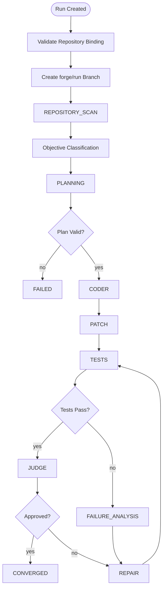

Execution phases are exposed to the Control Center so the operator can see exactly what Forge is doing.

---

## 10. Memory System

Forge uses memory to support long-horizon engineering work without sending the entire repository to every prompt.

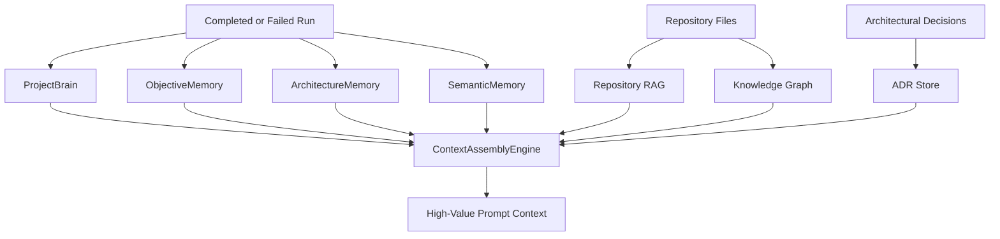

Memory systems:

- `ProjectBrain`: summaries, decisions, tradeoffs, successful patterns, failures, repairs
- `ArchitectureMemory`: service boundaries, important modules, dependency summaries
- `ObjectiveMemory`: prior objectives, plans, outcomes, failures, repairs
- `SemanticMemory`: local retrieval over previous work and repository knowledge
- `RepositoryRAG`: local repository file retrieval
- `KnowledgeGraph`: nodes and relationships for modules, tests, APIs, entities, services
- `ADRStore`: architectural decision records
- `ContextAssemblyEngine`: combines active objective, plan, files, memory, and graph context under a token budget

Memory can inform a run, but it must not replace the active objective. The current objective is always the highest-priority context.

---

## 11. Context Assembly Pipeline

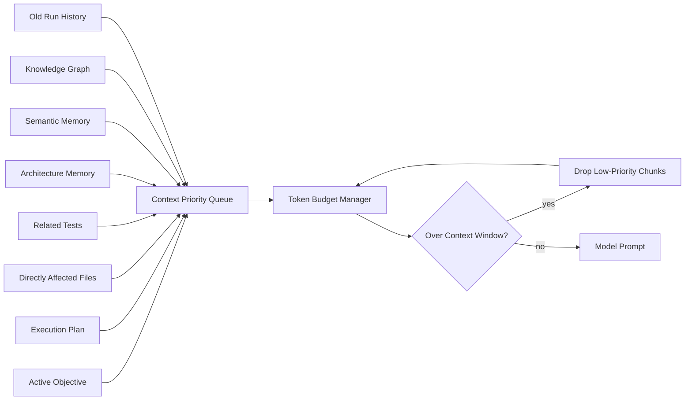

Context engineering is a first-class system because local models often have smaller context windows than cloud frontier models. Forge prioritizes:

1. active objective
2. execution plan
3. directly affected files
4. related tests
5. architecture memory
6. semantic memory
7. knowledge graph
8. old run history

---

## 12. Knowledge Graph Architecture

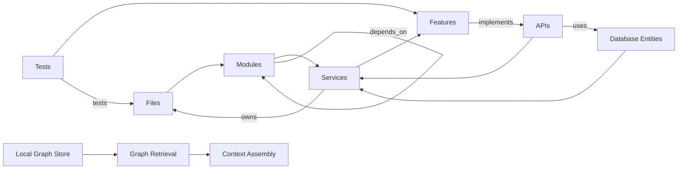

The graph allows Forge to reason beyond isolated files. If File A imports File B and tests depend on both, context expansion can include the right dependencies without flooding the prompt.

---

## 13. Autonomous Repair Loop

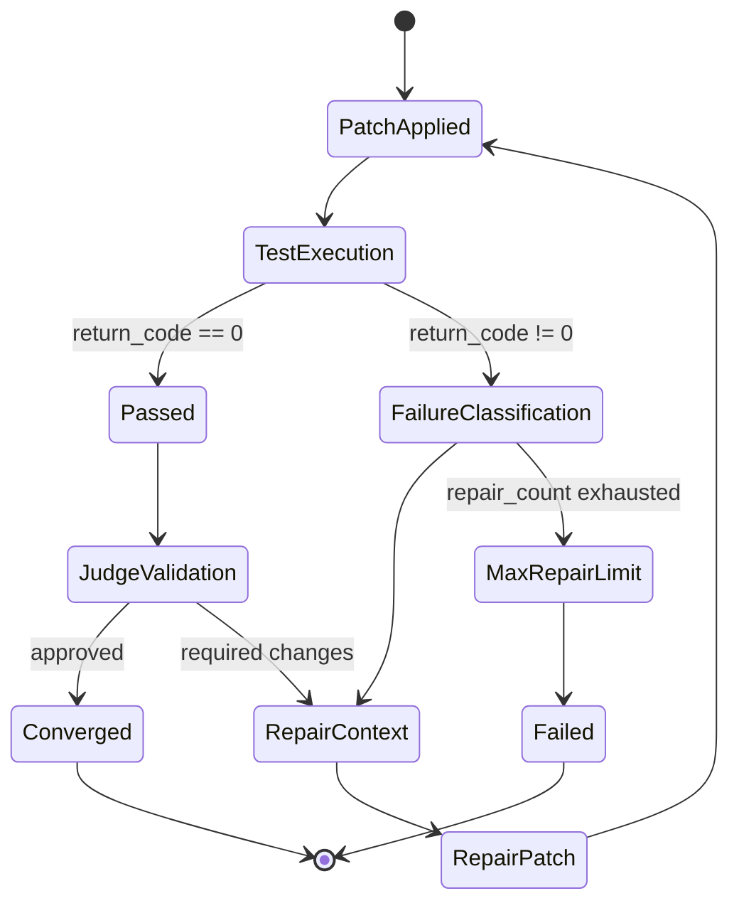

Failure classification captures:

- `SyntaxError`
- `ImportError`
- `ModuleNotFoundError`
- `AssertionError`
- `TypeError`
- `RuntimeError`
- test failure
- build failure
- lint failure

Repair context includes only relevant failure data:

- failing file
- traceback
- failing test
- last coder artifact
- last synth artifact
- targeted repository context

---

## 14. Validation Pipeline

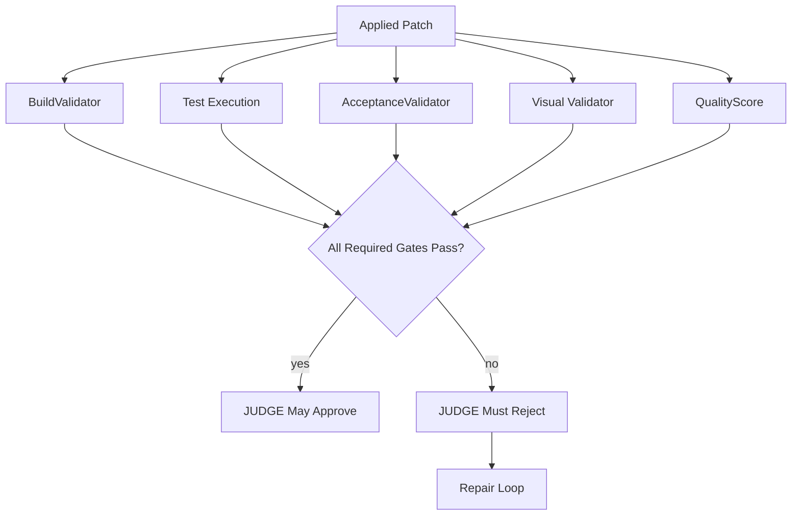

Validation checks include:

- objective satisfaction
- tests passing
- build passing
- required files created
- required routes created
- required APIs created
- placeholder detection
- documentation and maintainability scoring

The judge cannot approve code with failing tests or unmet acceptance requirements.

---

## 15. Git Safety Pipeline

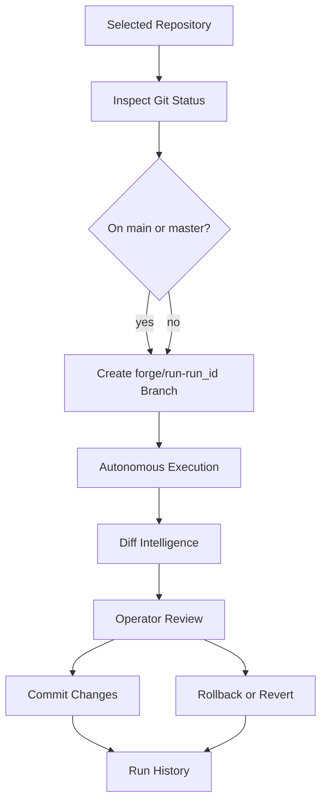

Forge should never modify `main` or `master` directly during autonomous execution. Every run is attached to a run id, branch, patch set, artifacts, test results, and report.

---

## 16. Workspace and Isolation Model

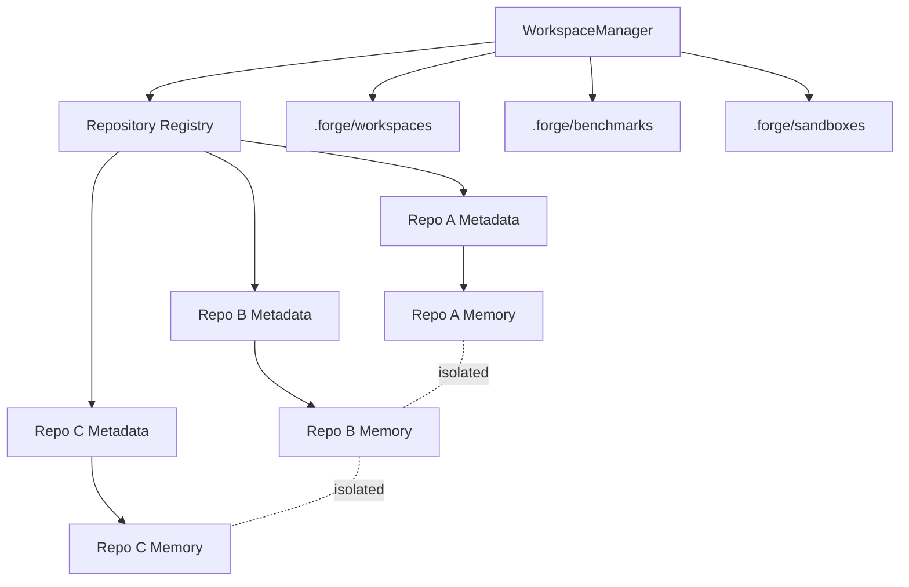

Benchmarks, validation projects, generated applications, and autonomous trials are expected to run in disposable managed workspaces. Forge itself should only be modified when it is explicitly selected as the target repository.

---

## 17. End-to-End Request Lifecycle

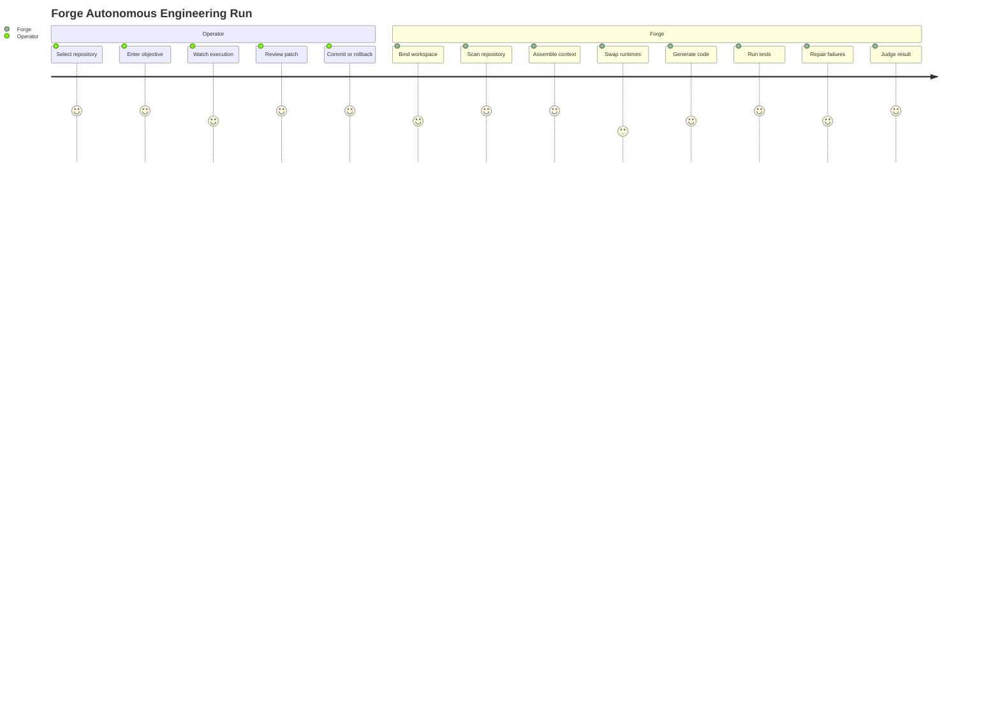

---

## 18. Local AI Economics

### Why Local AI Matters

Cloud AI coding tools are powerful, but they create recurring costs and external dependencies:

- token-based inference cost
- per-seat SaaS pricing
- vendor-owned memory and context
- network dependency
- limited control over inference lifecycle
- risk of repository context leaving local infrastructure
- lock-in to one model provider

Forge demonstrates a different operating model:

- own the inference runtime
- own the memory stores
- own repository context
- own orchestration
- own telemetry
- own Git safety
- own validation

The economic argument is not that local inference is free. GPUs, power, storage, and engineering time cost money. The argument is that organizations can convert recurring variable cloud inference cost into controlled local infrastructure while keeping sensitive engineering context inside their environment.

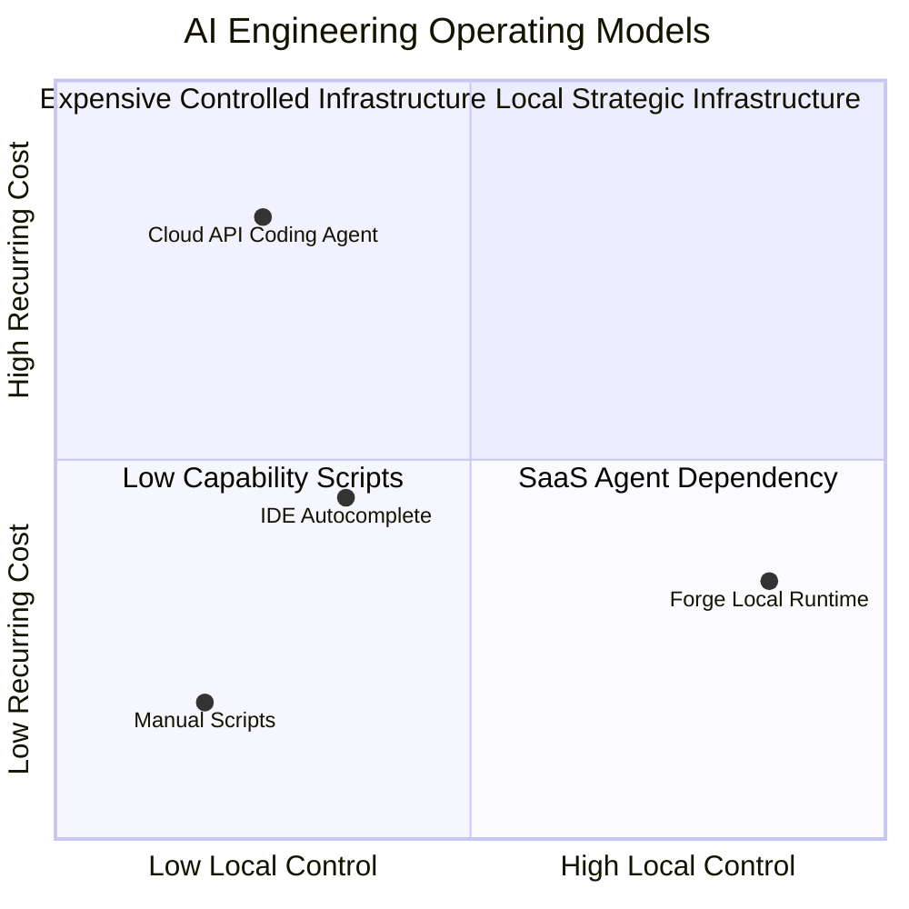

---

## 19. Engineering Challenges Solved

Forge exists because the hard parts are not the UI and not one model call. The hard parts are operational.

| Challenge | Forge System |
| --- | --- |
| Single GPU cannot hold all models | Sequential runtime autoswap |
| vLLM readiness races | RuntimeHealth checks `/v1/models` |
| Port conflicts | Runtime launch port checks and dynamic reassignment |
| Orphan CUDA workers | Process group shutdown |
| Context overflow | Context budget manager and priority trimming |
| Stale objective contamination | active objective priority and classifier telemetry |
| Cross-repository memory leakage | repository-scoped memory and RAG |
| Malformed model output | strict schema validation, JSON recovery, retries |
| False positive completion | acceptance contracts and judge hardening |
| Corrupt memory files | quarantine and rebuild recovery |
| Real repository safety | workspace manager, branches, rollback |

---

## 20. Metrics

Current Forge architecture includes:

- 3 courtroom roles
- 1 active runtime at a time
- single-GPU sequential autoswap
- vLLM OpenAI-compatible serving
- repository intelligence pipeline
- architecture memory
- objective memory
- semantic memory
- repository RAG
- knowledge graph
- ADR system
- context assembly engine
- autonomous repair loop
- convergence tracking
- Git safety layer
- workspace manager
- run history and replay
- production readiness scoring
- Control Center IDE surface

Execution phases:

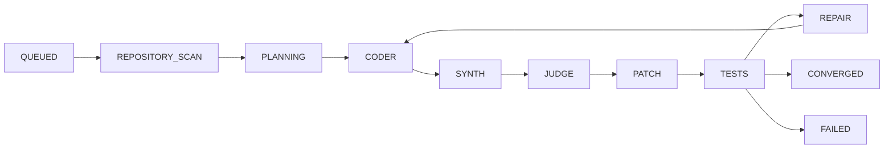

---

## 21. Control Center

The Control Center is the operator surface for Forge. It is designed as an AI engineering IDE rather than a monitoring dashboard.

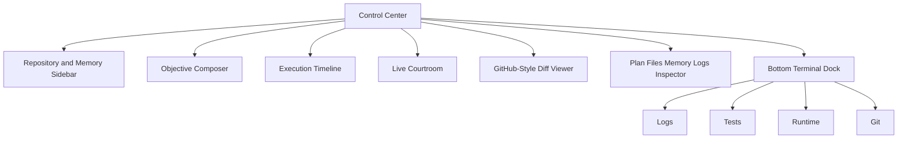

The UI answers the operator's immediate questions:

- What is Forge doing right now?
- Which model is active?
- Which files are changing?
- Which tests are running?
- Did validation pass?
- What did the models produce?
- What will be committed?

---

## 22. Future Roadmap

Forge is designed to evolve toward a full local autonomous engineering workstation.

Near-term:

- stronger browser-based visual validation
- richer semantic repository indexing
- larger benchmark suite
- better patch explainability
- improved model-specific prompt profiles
- more robust generated application validation

Medium-term:

- distributed local runtimes
- multi-GPU scheduling
- stronger task graph execution
- agent collaboration across repositories
- richer IDE integration
- advanced interactive approval gates

Long-term:

- workstation-scale alternative to cloud agent systems
- enterprise local deployment
- team-shared local memory stores
- reproducible autonomous engineering benchmarks
- hybrid single-GPU and multi-GPU orchestration

---

## 23. Why This Project Matters

Forge is a systems engineering project disguised as an AI coding agent.

It touches:

- LLM inference systems
- local vLLM serving
- runtime lifecycle control
- GPU memory management
- structured output enforcement
- repository analysis
- context engineering
- multi-agent orchestration
- autonomous repair
- Git safety
- local memory and retrieval
- operator experience design

The project demonstrates that useful autonomous software engineering requires much more than prompting a model. It requires infrastructure, state machines, telemetry, validation, memory, repository grounding, and safety boundaries.

Forge's thesis is that organizations should be able to own that infrastructure locally.
