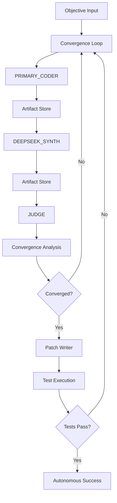
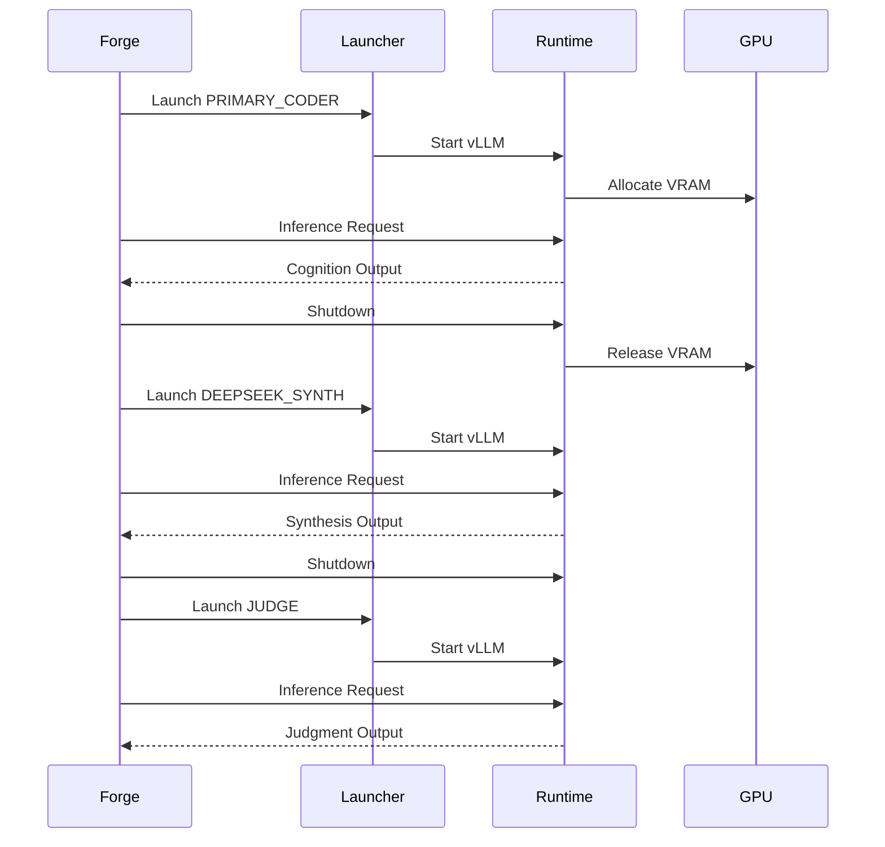
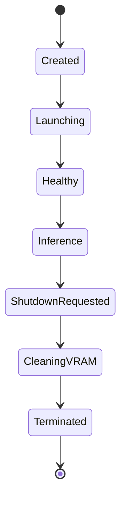

# Forge

Forge is an autonomous multi-model software engineering runtime designed for sequential cognition orchestration on a single GPU.

It combines:

* autonomous planning
* multi-role cognition
* runtime lifecycle management
* repository-aware reasoning
* patch generation
* convergence analysis
* execution/test loops

into a unified autonomous engineering system.

---

# Vision

Forge aims to evolve into a repository-aware autonomous engineering agent comparable to systems such as:

* OpenAI Codex
* Claude Code
* Devin-style engineering agents

while remaining:

* self-hosted
* modular
* runtime-controlled
* architecture-aware
* GPU-efficient

---

# Core Capabilities

## Autonomous Cognition

Forge supports:

* role-based reasoning
* multi-stage execution
* artifact persistence
* cognition replay
* convergence analysis
* retry/recovery workflows

---

## Sequential Multi-Model Orchestration

Forge uses:

* one GPU
* sequential runtime swaps
* isolated vLLM runtimes

instead of simultaneous multi-model execution.

Supported roles:

* PRIMARY_CODER
* DEEPSEEK_SYNTH
* JUDGE

---

## Runtime Lifecycle Control

Forge automatically:

* launches runtimes
* health-checks models
* performs inference
* swaps runtimes
* terminates process groups
* cleans VRAM
* recovers from failures

---

# System Architecture



---

# Runtime Orchestration



---

# Repository Cognition Layer

Forge includes repository-aware reasoning primitives.

Capabilities:

* dependency graphs
* impact analysis
* mutation blast-radius estimation
* architecture boundary enforcement
* module-level cognition prioritization

---

# Repository Cognition Flow


---

# Runtime Components

| Component           | Purpose                              |
| ------------------- | ------------------------------------ |
| RuntimeLauncher     | Starts vLLM runtimes                 |
| RuntimeShutdown     | Terminates runtime process groups    |
| RuntimeSwapEngine   | Sequential runtime orchestration     |
| RuntimeHealth       | Runtime readiness validation         |
| LocalInference      | OpenAI-compatible inference client   |
| AutonomousCourtroom | Multi-role cognition execution       |
| ConvergenceLoop     | Autonomous retry/convergence control |
| ArtifactStore       | Persistent cognition persistence     |

---

# Runtime Process Lifecycle



---

# Current Execution Strategy

Forge currently uses:

* sequential runtime swaps
* one active model at a time
* vLLM OpenAI-compatible serving
* process-group cleanup
* artifact-based cognition exchange

This design prioritizes:

* VRAM safety
* deterministic orchestration
* scalable runtime control

over raw latency.

---

# Current Limitations

Because Forge runs:

* multiple heavyweight models
* on a single GPU
* through sequential runtime swapping

runtime transitions are intentionally slower than always-on systems.

Current stabilization focus:

* orchestration reliability
* runtime cleanup correctness
* deterministic role progression
* output schema consistency
* recovery handling

---

# Project Structure

```text
backend/
│
├── runtime/
│   ├── autonomous_courtroom.py
│   ├── autonomous_run.py
│   ├── convergence_loop.py
│   ├── runtime_launcher.py
│   ├── runtime_shutdown.py
│   ├── runtime_swap_engine.py
│   ├── runtime_health.py
│   ├── runtime_process.py
│   ├── local_inference.py
│   ├── artifact_store.py
│   ├── artifact_loader.py
│   ├── repo_graph.py
│   ├── repo_analysis.py
│   ├── repo_boundary.py
│   └── ...
│
tests/
│
run_forge.py
```

---

# Execution Flow

```bash
python run_forge.py
```

Forge then:

1. launches PRIMARY_CODER
2. performs coding cognition
3. swaps runtime
4. launches DEEPSEEK_SYNTH
5. performs synthesis cognition
6. swaps runtime
7. launches JUDGE
8. evaluates convergence
9. writes patch
10. runs tests
11. retries if necessary

---

# Hardware Target

Optimized for:

* RTX 5090
* CUDA 13+
* Python 3.12
* WSL2
* vLLM

---

# Long-Term Goals

Planned future layers:

* web frontend
* live orchestration dashboard
* artifact visualization
* diff viewers
* repo navigation
* autonomous PR generation
* persistent runtime pools
* distributed multi-GPU execution
* architecture-aware patch validation
* autonomous repo exploration

---

# Status

Forge currently supports:

* autonomous runtime orchestration
* cognition artifact persistence
* convergence analysis
* repository cognition
* sequential multi-model execution
* autonomous patch/test loops

and is now entering:

* orchestration stabilization
* runtime optimization
* frontend development

---
