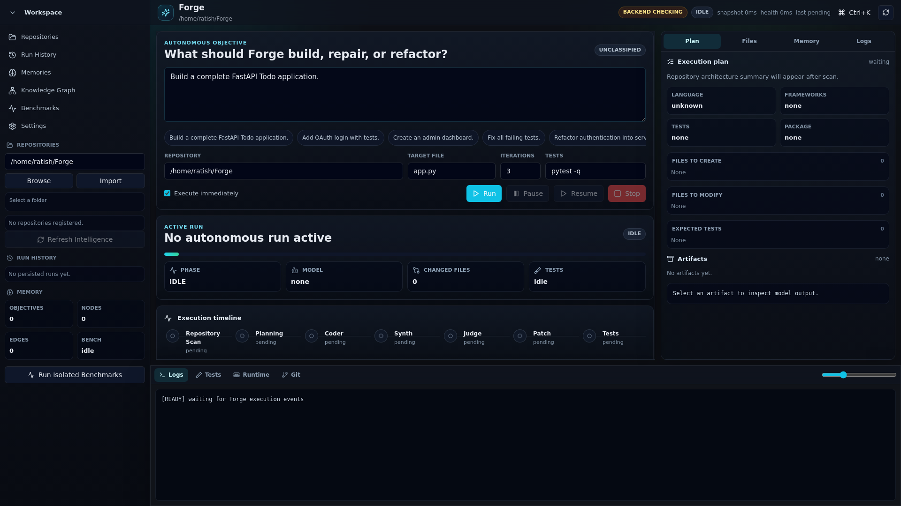
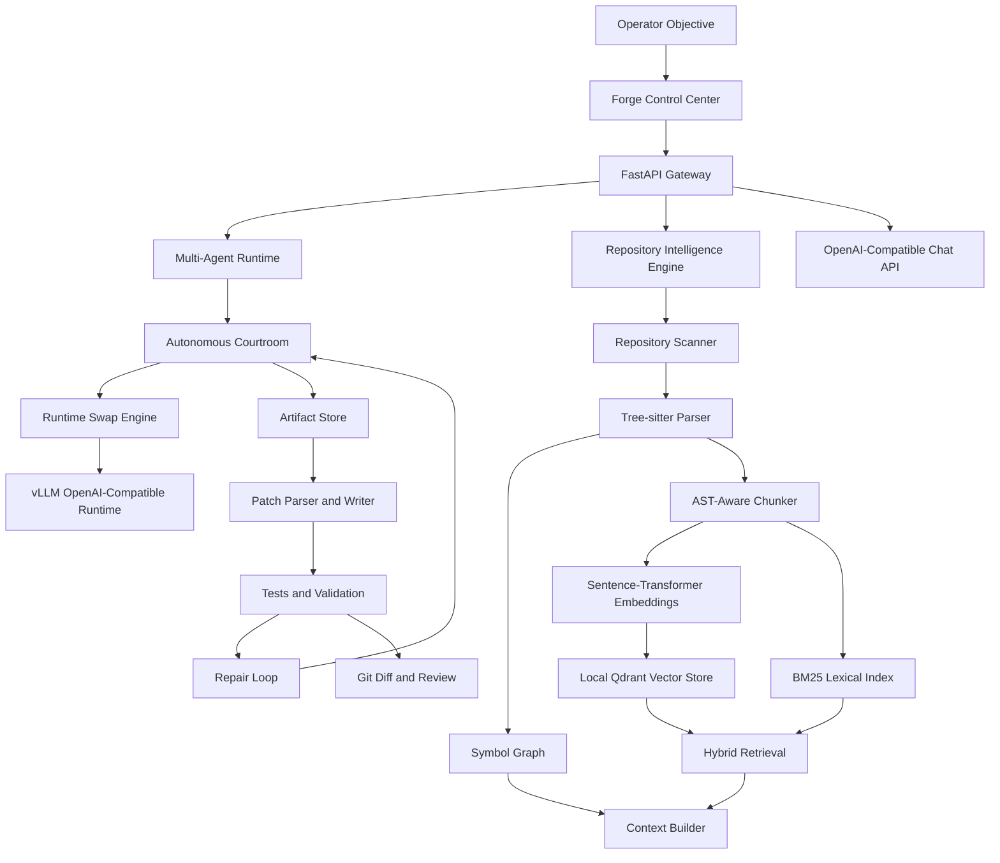
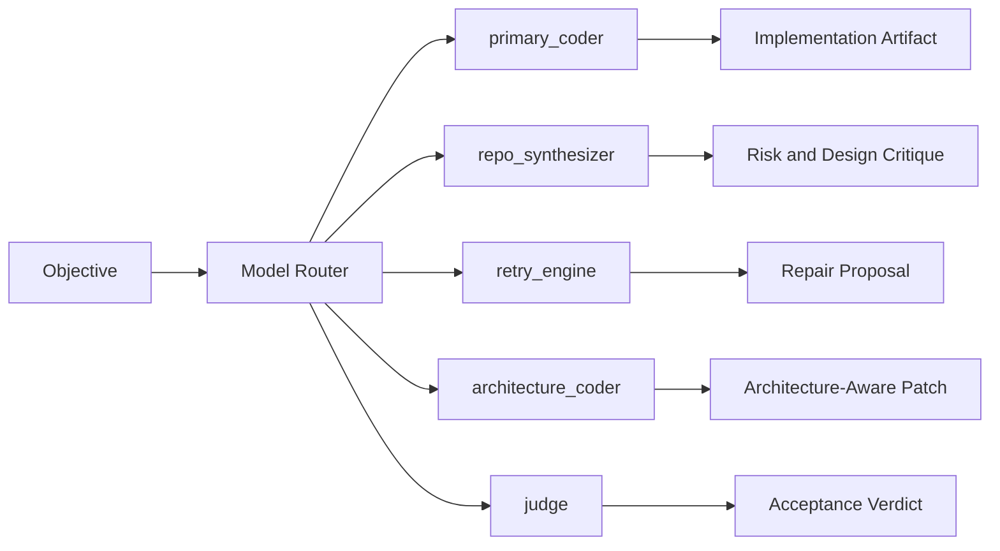
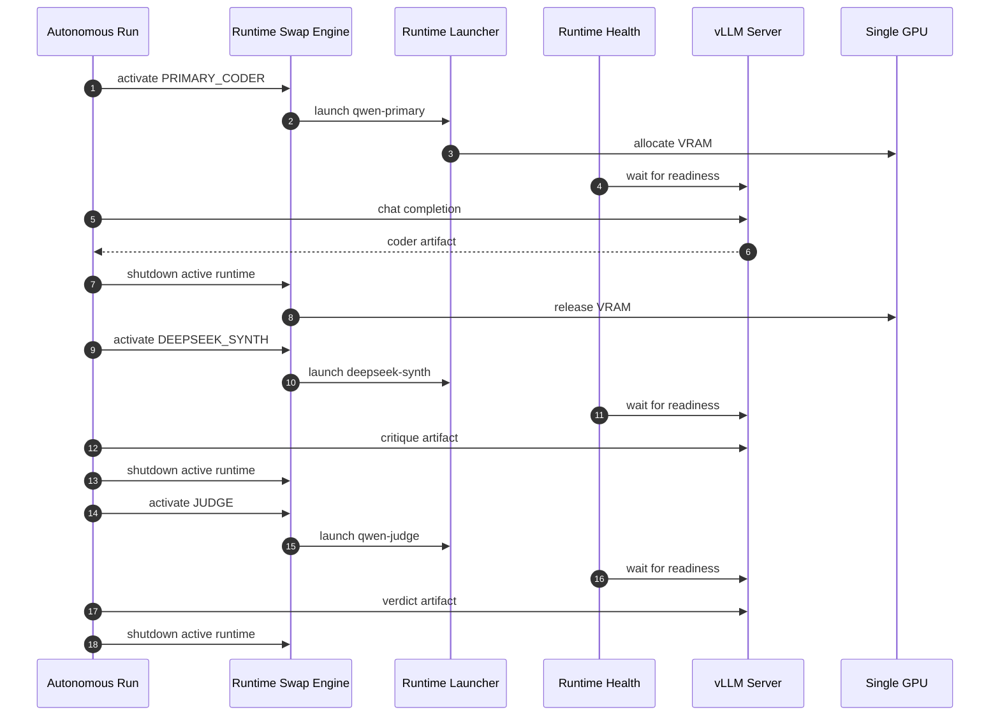
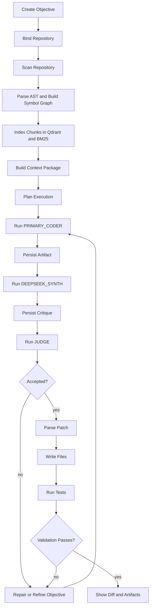
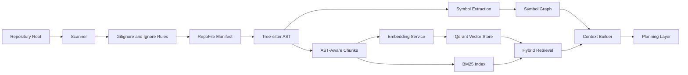
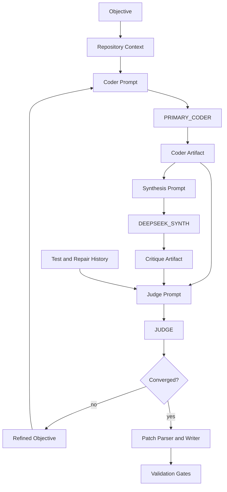

# Forge

**Local-first AI engineering infrastructure for autonomous repository work.**

Forge scans a codebase, builds repository intelligence, routes work through specialist local models, writes structured artifacts, applies patches, runs validation, repairs failures, and converges on a result without depending on cloud inference.

<p>
  
  
  
  
  
  
</p>



Forge is not a prompt wrapper. It is a systems project for local autonomous software engineering: inference lifecycle control, model routing, repository cognition, retrieval, artifacts, patch execution, validation, repair, Git safety, and an operator control plane.

## Why Forge Exists

Most AI coding systems hide the hard parts behind a hosted model endpoint. Forge works on the harder local systems problem:

- How do you coordinate multiple specialist coding models on one workstation GPU?
- How do you give a model enough repository context without dumping the whole repo into a prompt?
- How do you turn model output into structured, reviewable, testable patches?
- How do you prevent a model from declaring success when tests or acceptance criteria fail?
- How do you keep repository context, memory, artifacts, and inference inside infrastructure you control?

The central constraint is deliberate: **one active heavyweight model runtime at a time**. Forge swaps local vLLM runtimes through coder, synthesis, and judge stages so a single machine can run a multi-model engineering workflow without keeping every model resident in VRAM.

## Core Capabilities

| Area | What Forge Implements |
| --- | --- |
| Local inference | vLLM-backed OpenAI-compatible chat completions and streaming responses |
| Runtime orchestration | Sequential runtime swap, launch, health checks, process metadata, shutdown, and process-group cleanup |
| Model routing | Role-aware model registry for coder, synthesizer, retry, architecture, and judge roles |
| Repository intelligence | Scanner, Tree-sitter AST parsing, symbol graph, AST-aware chunking, embeddings, Qdrant, BM25, hybrid retrieval |
| Context engineering | Priority-based context assembly and token-budget trimming |
| Agent workflow | Courtroom pipeline with `PRIMARY_CODER`, `DEEPSEEK_SYNTH`, and `JUDGE` stages |
| Patch execution | Patch parsing, file writing, sandboxing primitives, pytest execution, failure feedback, repair loops |
| Validation | Patch validation, test gates, acceptance checks, convergence decisions, execution-aware judging |
| Git safety | Status, diff, staged diff, changed files, untracked files, branch/worktree abstractions |
| Observability | Structured runtime artifacts, run history, logs, request tracing, replay and artifact summary modules |

## Current Codebase

Forge is a Python 3.12 backend with a tracked Control Center screenshot and local model assets.

| Surface | Evidence |
| --- | --- |
| Backend | `backend/` contains 172 Python files and about 14.5k LOC |
| Tests | `tests/` contains 73 test files covering runtime, retrieval, orchestration, patches, validation, and GitOps |
| API | `backend/app.py`, `backend/api/routes/chat.py`, `backend/api/schemas/chat.py` |
| Runtime | `backend/runtime/runtime_launcher.py`, `runtime_shutdown.py`, `runtime_swap_engine.py`, `runtime_process.py` |
| Repo intelligence | `backend/repointel/service.py`, `scanner.py`, `ast/parser.py`, `retrieval.py`, `vector_store.py`, `graph.py` |
| Benchmarks | `benchmarks/repointel_benchmark.py`, `benchmarks/multi_agent_runtime_benchmark.py` |
| Config | `.env.example`, `backend/config/settings.py` |
| Operator UI asset | `frontend/screenshots/forge-control-center-1920.png` |

## Architecture Overview



Design principles:

- Runtime lifecycle is separate from cognition.
- Repository intelligence is built before code generation.
- Context is assembled under a budget, not blindly appended.
- Model output is persisted as artifacts before it becomes code.
- Tests and acceptance gates drive convergence.
- Git state remains inspectable before commit or rollback.

## System Design

Forge is organized as cooperating subsystems rather than a single agent loop.

| Subsystem | Primary Files | Responsibility |
| --- | --- | --- |
| API gateway | `backend/app.py`, `backend/api/routes/chat.py` | FastAPI app, health checks, OpenAI-compatible chat route |
| LLM service | `backend/llm/service.py`, `engine.py`, `prompting.py`, `decoding.py` | Prompt rendering, vLLM generation, streaming, usage accounting |
| Model registry/router | `backend/llm/registry.py`, `router.py` | Role-to-model registration and generation dispatch |
| Runtime lifecycle | `backend/runtime/runtime_*` | Launch, health, swap, shutdown, runtime metadata |
| Courtroom runtime | `backend/runtime/autonomous_courtroom.py`, `convergence_loop.py` | Multi-role reasoning and convergence |
| Repository intelligence | `backend/repointel/*` | Scan, parse, chunk, embed, retrieve, plan |
| Patch and execution | `backend/runtime/patch_*`, `execution_*`, `pytest_runner.py` | Parse model output, write files, run commands, classify failures |
| Artifacts and replay | `backend/runtime/artifact_*`, `replay_context.py` | Persist, load, summarize, compress, replay model artifacts |
| Git operations | `backend/runtime/gitops.py`, `git_diff.py`, `worktrees.py` | Status, diffs, staging, worktree/repository safety |

## Model Routing Pipeline

Forge can use local models for different engineering responsibilities instead of forcing one model to be coder, reviewer, repair engine, and judge.



The canonical courtroom path currently uses:

- `PRIMARY_CODER`: implementation artifact generation.
- `DEEPSEEK_SYNTH`: architecture and risk critique.
- `JUDGE`: convergence and acceptance decision.

## Local Model Set

Forge uses three local model slots because the autonomous coding loop needs role separation without turning the runtime into an unbounded model zoo. The names below are the served model names passed to the local OpenAI-compatible vLLM server in `backend/runtime/autonomous_courtroom.py`.

| Courtroom role | Served model name | Base model | Local path | Why this model is used |
| --- | --- | --- | --- | --- |
| `PRIMARY_CODER` | `qwen-primary` | `Qwen/Qwen3.5-35B-A3B` | `models/qwen-primary` | Primary implementation model. It is the default code-writing model because Qwen3.5 provides strong long-context reasoning, tool-use behavior, and coding capability for repository-scale edits. |
| `DEEPSEEK_SYNTH` | `deepseek-synth` | `deepseek-ai/deepseek-coder-33b-instruct` | `models/deepseek-synth` | Independent synthesis and critique model. It gives the loop a different coder-family prior for architectural review, failure analysis, and challenging the primary implementation before a verdict is made. |
| `JUDGE` | `qwen-judge` | `Qwen/QwQ-32B` | `models/qwen-judge` | Dedicated reasoning judge. It keeps final acceptance separate from the implementation model, reducing self-approval bias when evaluating tests, risks, and convergence. |

Forge keeps the default runtime to these three models only because each role maps to a concrete engineering responsibility: generate, critique, and decide. Adding more always-on models would increase swap time, artifact volume, and validation latency without improving the core control loop unless a new model owns a distinct production responsibility.

## Single-GPU Runtime Autoswap

Forge's runtime strategy is built for a workstation constraint: multiple large models, one active GPU runtime.



Runtime primitives:

- `RuntimeProcess`: role, model path, served model name, port, PID, PGID, launch state.
- `RuntimeLauncher`: starts a vLLM OpenAI-compatible server and writes role-specific logs.
- `RuntimeShutdown`: terminates the whole process group so child CUDA workers are cleaned up.
- `RuntimeSwapEngine`: guarantees shutdown-before-launch and preserves swap history.
- `LocalInference`: calls the active local OpenAI-compatible endpoint and normalizes model output.

## Request Lifecycle



## Repository Intelligence Pipeline

Forge builds local repository intelligence before prompting the coding model.



Implemented repository intelligence components:

- `RepositoryScanner`: file discovery, ignore handling, incremental manifest.
- `TreeSitterAstEngine`: Python, JavaScript, TypeScript, Go, Rust parser support through Tree-sitter packages.
- `SymbolGraphEngine`: file and symbol relationships.
- `AstAwareChunker`: symbol-aware context chunks.
- `EmbeddingService`: local sentence-transformer embeddings.
- `QdrantVectorStore`: local persisted vector collections.
- `BM25Index`: lexical search for exact code terms.
- `HybridRetrievalEngine`: vector + lexical + overlap reranking.
- `ContextBuilder` and `PlanningLayer`: context packaging and execution planning.

## Agent Execution Pipeline



Each role produces inspectable artifacts. Forge can replay, summarize, compress, merge, and query artifacts instead of relying on hidden chain state.

## OpenAI-Compatible API

Forge exposes a local chat completion route:

```http
POST /v1/chat/completions
```

Supported request fields include:

- `model`
- `request_id`
- `agent_id`
- `messages`
- `temperature`
- `max_tokens`
- `top_p`
- `stream`

The API validates request shape with Pydantic and supports both JSON responses and SSE streaming.

Example:

```bash
curl http://localhost:8000/v1/chat/completions \
  -H "content-type: application/json" \
  -d '{
    "model": "deepseek-coder",
    "messages": [{"role": "user", "content": "Explain this repository"}],
    "temperature": 0.2
  }'
```

## Deployment Options

Current supported path: local workstation.

Requirements:

- Python 3.12.
- CUDA-capable machine for vLLM-backed local inference.
- Local model directories or Hugging Face model access.
- Enough disk for model weights and local vector indexes.

Install:

```bash
python3.12 -m venv .venv
source .venv/bin/activate
pip install -e ".[dev]"
cp .env.example .env
```

Run API:

```bash
uvicorn backend.app:app --host 0.0.0.0 --port 8000
```

Run tests:

```bash
pytest -q
```

Run repository intelligence benchmark:

```bash
python benchmarks/repointel_benchmark.py /path/to/repo "authentication flow"
```

Run multi-agent runtime benchmark:

```bash
python benchmarks/multi_agent_runtime_benchmark.py --task-count 10
```

Current repository does not include Docker, Compose, or Kubernetes deployment assets. Those are roadmap items, not current README claims.

## Production-Oriented Features

Forge is not presented as a managed SaaS. It is a local infrastructure codebase with production-oriented primitives:

- Explicit runtime process metadata and lifecycle state.
- Process-group shutdown for vLLM child workers.
- Pydantic API validation with forbidden extra fields.
- Structured request tracing and usage accounting.
- Local Qdrant persistence for retrieval state.
- Repository-scoped ignore rules and incremental index state.
- Patch validation before writing.
- Pytest execution inside a controlled working directory.
- Git status, diff, staged diff, changed files, and untracked files APIs.
- Artifact persistence, replay, compression, and summary modules.
- Convergence, retry, recovery, and repair abstractions.
- Broad test suite across runtime, repository intelligence, orchestration, patches, validation, artifacts, and GitOps.

## Performance Characteristics

Forge is designed around controllable local performance rather than hosted API throughput.

| Characteristic | Implementation |
| --- | --- |
| GPU memory pressure | Sequential one-runtime-at-a-time autoswap |
| Inference throughput | vLLM serving with prefix caching and configurable max sequences |
| Context window pressure | Priority-based context budget manager |
| Retrieval latency | Local Qdrant plus in-process BM25 index |
| Repository indexing | Incremental manifest, AST parsing, chunking, embeddings, vector upsert |
| Runtime observability | Runtime logs, PID/PGID metadata, swap history, request traces |
| Benchmarking | Separate scripts for repository intelligence and multi-agent runtime throughput |

Exact throughput depends on GPU, model size, quantization, context length, and repository size. The repo includes benchmark scripts so measurements can be produced on the target hardware instead of guessed in documentation.

## Security and Safety

Forge's security posture is local-first and review-first:

- Repository content, embeddings, vector store, artifacts, and model calls can stay on local infrastructure.
- No cloud model provider is required by the core local runtime path.
- API schemas reject unexpected fields.
- Runtime shutdown targets process groups to reduce orphan worker risk.
- Patch outputs are parsed and validated before application.
- Test and validation gates feed convergence decisions.
- Git diffs remain visible before commit.
- Worktree and workspace abstractions are present for repository isolation.

This is not a substitute for sandboxing untrusted code. Treat model-generated code and test execution as privileged local operations unless additional isolation is added.

## Tech Stack

| Layer | Stack |
| --- | --- |
| API | FastAPI, Pydantic, Uvicorn-compatible ASGI |
| Inference | vLLM, OpenAI-compatible chat completions, transformers tokenizer |
| Runtime | subprocess process groups, runtime metadata, local HTTP inference |
| Retrieval | Qdrant local store, sentence-transformers, BM25 |
| Parsing | Tree-sitter for Python, JavaScript, TypeScript, Go, Rust |
| Agent runtime | Multi-agent orchestration, courtroom roles, convergence loops |
| Validation | pytest, execution policy, patch validation, Git diffs |
| Persistence | filesystem artifacts, local `.forge` state, local model directories |
| Testing | pytest, pytest-asyncio |

## Roadmap

Near term:

- Stronger runtime health checks around vLLM readiness and model registry validation.
- More complete benchmark reporting with hardware profiles.
- Improved patch explainability and artifact diff views.
- Better visual validation for generated frontend work.
- Contributor guide and issue templates.

Medium term:

- Docker and Compose deployment.
- Multi-GPU scheduling.
- More robust runtime placement and port management.
- Richer repository graph queries.
- Operator approval gates before file writes.
- Frontend source tracked alongside screenshot assets.

Long term:

- Team-shared local memory stores.
- Distributed local runtimes.
- Enterprise local deployment patterns.
- Reproducible autonomous engineering benchmark suite.
- Hybrid local/cloud routing where policy allows it.

## Contributing

High-impact contribution areas:

- Runtime lifecycle reliability.
- Repository intelligence and retrieval quality.
- Patch parsing and validation.
- Test coverage for failure and repair loops.
- Benchmarking with reproducible hardware profiles.
- Operator UI source and interaction design.
- Documentation for local model setup.

Development loop:

```bash
pip install -e ".[dev]"
pytest -q
python scripts/smoke_test_repo_intel.py
python scripts/smoke_test_multi_agent_runtime.py
```

Before opening a PR, include:

- The problem being solved.
- The subsystem touched.
- Tests or benchmark commands run.
- Any model/runtime assumptions.
- Any repository safety implications.

## Project Thesis

Useful autonomous software engineering is not one model call. It is infrastructure:

- model serving
- runtime lifecycle control
- repository understanding
- context retrieval
- structured artifacts
- validation gates
- repair loops
- Git safety
- operator visibility

Forge is an implementation of that thesis for local AI engineering.
